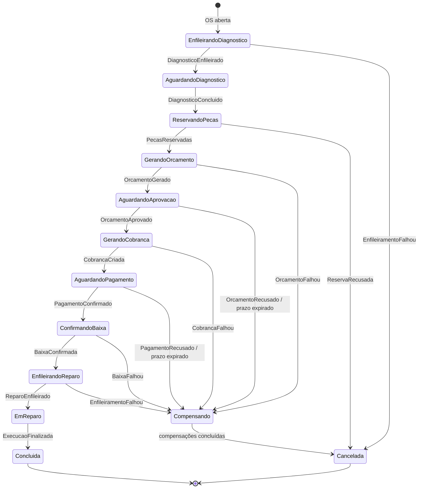

# ADR-0008: Saga orquestrada, com o orquestrador dentro do OS Service

| | |
|---|---|
| **Status** | Aceito |
| **Data** | 2026-10-03 |

## Contexto

Até a Fase 3, a aprovação do orçamento era uma única transação no PostgreSQL: `execute_approval` decrementava o estoque de todas as peças e mudava o status da OS para `em_execucao`, tudo ou nada. Com a decomposição em microsserviços ([RFC-0006](../rfcs/0006-decomposicao-em-microsservicos.md)), estoque, orçamento/pagamento e execução passam a ter bancos separados, e não existe mais uma transação que cubra todos eles. O PDF da Fase 4 exige o **Saga Pattern** para coordenar esse fluxo, com rollback e compensação em caso de falha em qualquer etapa, e pede que a escolha entre orquestração e coreografia seja justificada.

Duas decisões precisavam ser tomadas: **o estilo da saga** e **onde fica o orquestrador**, se for orquestrada.

## Decisão

**Saga orquestrada**, com o orquestrador implementado como um módulo isolado (`app/saga/`) **dentro do OS Service**. O estado de cada saga é persistido numa tabela `sagas` do PostgreSQL do OS Service, e o orquestrador conversa com os participantes (Estoque, Orçamento & Pagamento e Execução) por comandos e eventos via SQS/SNS ([RFC-0007](../rfcs/0007-mensageria-sqs-sns.md)).

O fluxo segue o exemplo do próprio PDF (abrir a OS → gerar orçamento → aguardar aprovação → enviar para execução), com duas etapas a mais: o **diagnóstico antes do orçamento**, que é onde o mecânico define quais serviços e peças a OS precisa, e o **pagamento** entre a aprovação e a execução:

- **Diagnóstico define o orçamento.** A OS é aberta só com o cliente, o veículo e a descrição do problema. A Execução recebe a OS na fila de diagnóstico, o mecânico examina o veículo e registra quais serviços e peças são necessários. A Execução valida esses itens no Catálogo (REST síncrono) e devolve no evento `DiagnosticoConcluido` os itens com os preços copiados. A partir daí a saga reserva as peças e gera o orçamento. O diagnóstico em si não tem compensação: ele não tem efeito colateral sobre outro serviço.
- **Compensação.** Cada passo com efeito colateral tem uma ação inversa: `LiberarPecas` desfaz `ReservarPecas`, `CancelarOrcamento` desfaz `GerarOrcamento`, `EstornarPagamento` desfaz o pagamento e `DevolverPecas` desfaz `ConfirmarBaixa`. Ao entrar em `Compensando`, o orquestrador dispara as compensações dos passos já concluídos, na ordem inversa, e só marca a saga como `Cancelada` quando todas forem confirmadas.
- **Ponto sem volta.** `ReparoEnfileirado` é o ponto a partir do qual a saga não é mais compensada: as peças começam a ser usadas no veículo. Falhas depois disso (por exemplo, um reparo que não dá certo) são tratadas pela operação da oficina, não por rollback automático.
- **Compensações não podem falhar de vez.** Elas são idempotentes e reenviadas até serem confirmadas. Se uma compensação esgotar as tentativas, a mensagem vai para a DLQ e a saga fica em `Compensando`, visível no monitoramento para intervenção manual. Ela nunca é marcada como `Cancelada` sem a confirmação de todas as compensações.
- **Prazos.** As esperas pelo cliente (aprovação do orçamento, pagamento) e as esperas por resposta de participante têm prazo configurável. Uma tarefa periódica do orquestrador reenvia o comando pendente ou, esgotadas as tentativas, inicia a compensação.

A lista completa de comandos, eventos, compensações e o mapeamento entre o estado da saga e o status da OS estão em [`docs/saga.md`](../saga.md).

## Alternativas consideradas

- **(Descartada) Saga coreografada**: cada serviço reagiria aos eventos dos outros, sem coordenador central. É mais desacoplada, mas o fluxo da OS ficaria espalhado em cinco repositórios: para responder "em que passo está a OS 42 e o que falta compensar?", seria preciso juntar o estado de vários serviços. Cada participante também precisaria conhecer os eventos dos demais para decidir quando compensar. Com uma sequência longa (reservar → orçar → aprovar → cobrar → baixar → enfileirar), compensações diferentes por etapa e prazos de espera pelo cliente, a orquestração deixa o fluxo legível num lugar só, testável num cenário BDD e fácil de mostrar no vídeo.
- **(Descartada) Orquestrador em serviço/repositório próprio**: daria uma separação mais visível, mas o estado da saga e o status da OS ficariam em bancos diferentes. Cada avanço da saga precisaria atualizar o OS Service por mensagem, com resposta, prazo e reenvio, o que é uma segunda saga só para manter os dois sincronizados. Com o orquestrador dentro do OS Service, avançar a saga, mudar o status da OS e gravar o próximo comando na outbox acontecem na **mesma transação local**. Esse é também o desenho de referência do padrão: em *Microservices Patterns* (Chris Richardson), a saga de criação do pedido fica no próprio serviço que é dono do agregado e inicia o fluxo. Por fim, seria um sexto serviço para reprovisionar a cada rotação do AWS Academy Lab.

## Consequências

- **Positivas**: o fluxo inteiro, incluindo as compensações, está num único módulo testável. O estado de cada saga é consultável (tabela `sagas` + histórico de status da OS) e aparece no rastreio da OS. Os participantes ficam simples: executam um comando e publicam o resultado, sem conhecer o fluxo.
- **Negativas**: o OS Service concentra a lógica de coordenação, o que o torna o serviço mais complexo e o mais crítico do sistema. Se ele cair, nenhuma saga avança (mas nenhuma se perde, porque as mensagens ficam retidas nas filas e o estado está no banco).
- **Mudança na abertura e na máquina de status da OS**: os serviços e peças deixam de ser informados na abertura (`POST /service-orders`) e passam a ser definidos no diagnóstico, dentro da Execução. Aparecem os status `aguardando_pagamento` e `cancelada`. O fluxo fica `recebida → em_diagnostico → aguardando_aprovacao → aguardando_pagamento → em_execucao → finalizada → entregue`, com `recusada` e `cancelada` como saídas terminais. `docs/regras-negocio.md` e `docs/api.md` precisam ser atualizados junto com a implementação.
- **A reserva acontece depois do diagnóstico**: só então se sabe quais peças a OS precisa. Se faltar estoque nesse momento, a OS é cancelada (`ReservaRecusada`). Esperar a reposição do estoque em vez de cancelar fica como evolução possível.
- **Evolução possível**: se o número de sagas crescer, o módulo `app/saga/` pode ser extraído para um serviço próprio. Ele não importa nada dos outros contextos do OS Service, só se comunica por portas.
