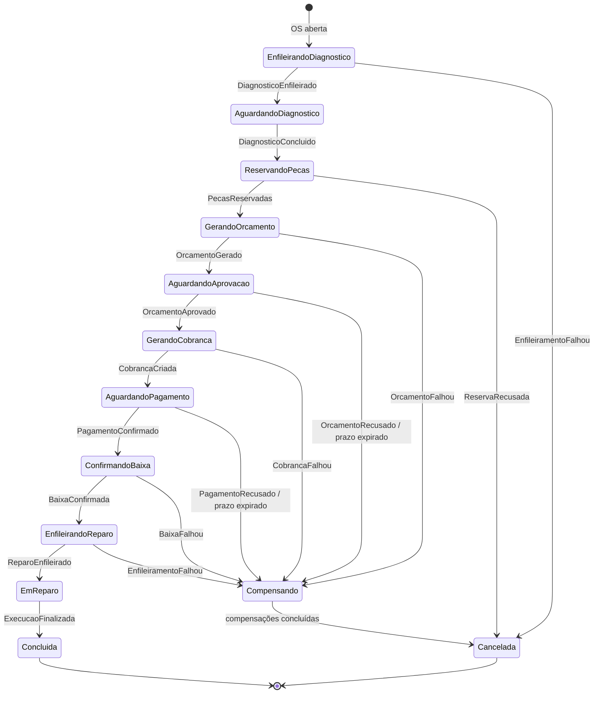

# ADR-0010: O diagnóstico define o orçamento

| | |
|---|---|
| **Status** | Aceito |
| **Data** | 2026-10-03 |

## Contexto

A [ADR-0008](0008-saga-orquestrada-no-os-service.md) desenhou a saga da OS seguindo literalmente o exemplo de fluxo do PDF da Fase 4 (abrir a OS → gerar orçamento → aguardar aprovação → enviar para execução). Nesse desenho, os serviços e peças continuavam sendo informados na abertura da OS, como nas Fases 2 e 3, e o diagnóstico ia para depois do pagamento, dentro da Execução.

Revisando esse fluxo antes de implementá-lo, ficou claro que ele inverte a ordem de uma oficina real: o cliente aprovaria e pagaria um orçamento antes de o mecânico examinar o veículo. Se o diagnóstico encontrasse algo além do previsto, não haveria como incluir no orçamento. Nas fases anteriores o diagnóstico vinha antes do orçamento, mas só registrava observações: os itens já vinham da abertura.

## Decisão

**O diagnóstico acontece antes do orçamento e é ele que define os itens da OS.**

- A OS é aberta só com cliente, veículo e descrição do problema (`POST /service-orders` deixa de receber serviços e peças).
- A saga começa colocando a OS na fila de diagnóstico da Execução (`EnfileirarDiagnostico`). O mecânico examina o veículo e, ao concluir o diagnóstico, informa quais serviços e peças são necessários.
- A Execução valida esses itens no Catálogo por REST síncrono e copia os preços. Ela publica `DiagnosticoConcluido` com os itens e preços, e a saga segue para a reserva de peças e o orçamento.
- A Execução participa duas vezes da saga: no diagnóstico (`EnfileirarDiagnostico`) e no reparo (`EnfileirarReparo`, que passa a ser o ponto sem volta).

Nova máquina de status da OS: `recebida → em_diagnostico → aguardando_aprovacao → aguardando_pagamento → em_execucao → finalizada → entregue`, com `recusada` e `cancelada` como saídas terminais. O contrato completo (comandos, eventos, compensações) está em [`docs/saga.md`](../saga.md).

## Alternativas consideradas

- **(Descartada) A: diagnóstico depois do pagamento** (o desenho original da ADR-0008). É a leitura mais literal do exemplo do PDF e dá a saga mais curta, mas o cliente paga antes de o carro ser examinado, e o diagnóstico não consegue alterar o orçamento.
- **(Descartada) C: diagnóstico antes do orçamento, com os itens ainda informados na abertura.** É a menor mudança em relação às regras das Fases 2 e 3: a máquina de status quase não muda, e a abertura continua devolvendo 404 imediato para item inexistente. Mantém a limitação de que o diagnóstico não altera o orçamento.
- **(Escolhida) B: diagnóstico antes do orçamento, definindo os itens.** É a mais fiel ao funcionamento de uma oficina e dá ao diagnóstico um papel real no fluxo, em troca de mais mudanças na API e na saga.

## Consequências

- **Substitui parcialmente a ADR-0008**: o diagrama de estados e a mudança na máquina de status descritos lá deixam de valer. O resto da ADR-0008 continua valendo: saga orquestrada, orquestrador dentro do OS Service, compensações, prazos.
- **Muda quem consulta o Catálogo**: a Execução, ao concluir o diagnóstico, em vez do OS Service na abertura da OS. A validação de item inexistente ou desativado vira um erro na tela do diagnóstico, e não mais um 404 na abertura. Registrado como revisão na [RFC-0006](../rfcs/0006-decomposicao-em-microsservicos.md) e na [RFC-0007](../rfcs/0007-mensageria-sqs-sns.md).
- **A reserva de peças só acontece depois do diagnóstico**, quando se sabe o que a OS precisa. Se faltar estoque nesse momento, a OS é cancelada (`ReservaRecusada`). Esperar a reposição em vez de cancelar fica como evolução possível.
- **O diagnóstico não tem compensação**: ele não altera nada em outro serviço. Se a fila de diagnóstico não aceitar a OS, ela é cancelada sem nada a desfazer.
- **Mudança de API**: `POST /service-orders` muda de formato, e `docs/regras-negocio.md` e `docs/api.md` precisam ser atualizados junto com a implementação do OS Service.
