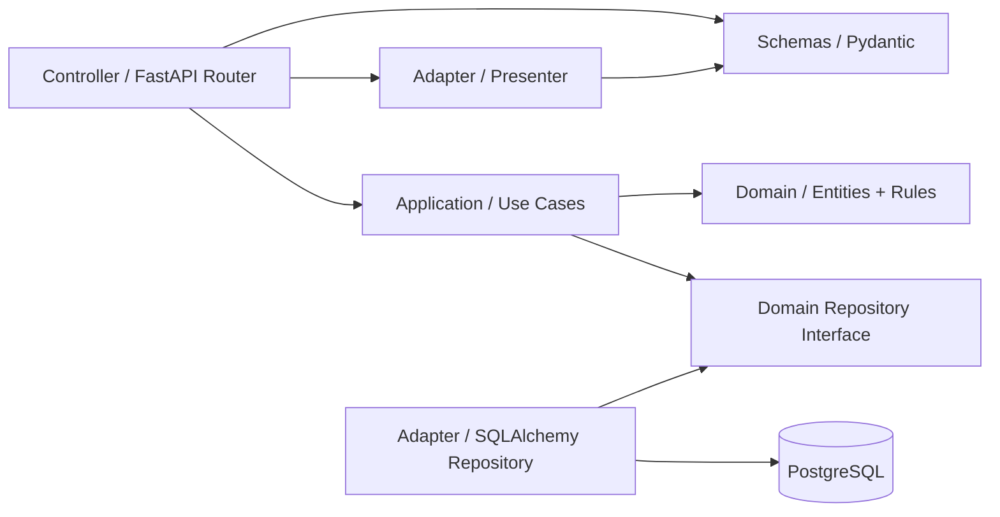
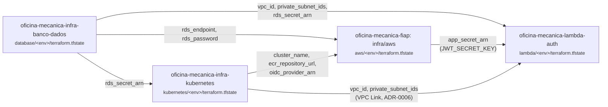
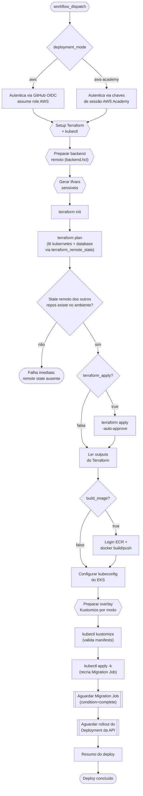

# Arquitetura

## Justificativa do banco de dados

A primeira versão do MVP foi implementada com **SQLite** por simplicidade de setup local. Para esta evolução, o banco foi migrado para **PostgreSQL**, motivado por:

- **Modelo cliente-servidor real**: o PostgreSQL é executado em um processo dedicado (no Compose, no CI e em produção), o que se aproxima do cenário operacional final e elimina particularidades do SQLite (banco em arquivo, locking em escrita concorrente, ausência de tipos ricos).
- **Concorrência e integridade**: oficinas mecânicas têm múltiplos usuários e fluxos concorrentes (criação de OS, baixa de estoque, atualização de status). O PostgreSQL oferece MVCC, transações reais e checagem de constraints mais robusta, incluindo `ON DELETE CASCADE` e `ON DELETE RESTRICT` honrados nativamente.
- **Aderência ao ambiente de execução**: como toda a stack já roda em containers, manter o banco como um serviço separado deixa o ambiente local idêntico ao de CI e ao de produção.
- **Evolução prevista**: a justificativa anterior já apontava o PostgreSQL como destino natural; esta entrega concretiza essa migração sem alterar a Clean Architecture. Domínio, casos de uso e controllers permanecem intactos.
- **CI determinístico**: o pipeline usa Testcontainers para provisionar um PostgreSQL `postgres:16-alpine` efêmero durante a suíte de testes.

## Clean Architecture

O projeto adota **Clean Architecture** organizada por **contextos de domínio**. Cada contexto é independente e possui suas próprias quatro camadas internas, com dependências fluindo sempre de fora para dentro.

### Regra de dependência

```text
controller  ->  application  ->  domain
    |               |
adapters    ->  domain (implements interface)
```

- **Domínio** não conhece nada externo, como FastAPI, SQLAlchemy ou Pydantic.
- **Application** depende apenas de interfaces abstratas (`IXxxRepository`).
- **Adapters** implementam as interfaces do domínio.
- **Controller** injeta as implementações concretas via `Depends` do FastAPI.

## Diagrama de componentes

O diagrama abaixo, na notação **C4 (nível de componentes)**, representa os principais componentes da aplicação e suas dependências externas. Os atores (`Usuário Administrador` e `Cliente da Oficina`) aparecem como `Person`, a aplicação é um limite (`boundary`) com seus componentes internos, e os serviços externos (`PostgreSQL` e `SMTP Provider`) ficam fora da aplicação.


### Leitura do diagrama

- **Atores**: o `Usuário Administrador` gerencia clientes, veículos, catálogo, peças e ordens; o `Cliente da Oficina` acompanha e aprova ordens pelos endpoints públicos.
- **Entrada HTTP**: a `FastAPI Application` concentra o roteamento autenticado, o `Auth / Login JWT` cuida da autenticação e emissão de token, e os `Endpoints públicos` expõem ações sem autenticação.
- **Contextos de domínio**: `System`, `Clients`, `Vehicles`, `Service Catalog`, `Parts` e `Service Orders` representam os componentes funcionais da aplicação. `Service Orders` é o componente central do fluxo de negócio, porque orquestra diagnóstico, orçamento, aprovação, recusa, baixa de estoque e entrega.
- **Shared**: não é um domínio de negócio; oferece recursos transversais (security/JWT, validators, error mapping, DB session e email port) consumidos pelos demais componentes.
- **Serviços externos**: o `Banco de Dados da Oficina` (PostgreSQL) é acessado via `shared` (SQLAlchemy) e o `SMTP Provider` recebe os envios de e-mail.

## Diagrama de componentes internos dos contextos

Cada contexto de domínio segue a mesma organização interna. O diagrama abaixo detalha como os componentes internos se relacionam dentro de um contexto, mantendo a regra de dependência da Clean Architecture.



### Leitura do diagrama interno

- `Controller` recebe a requisição HTTP, valida dependências e chama casos de uso.
- `Schemas` definem os contratos Pydantic de entrada e saída.
- `Application / Use Cases` orquestra regras do domínio e depende de interfaces, não de implementações concretas.
- `Domain` concentra entidades, objetos de valor e regras puras de negócio.
- `Domain Repository Interface` define o contrato exigido pelo domínio.
- `Adapter / SQLAlchemy Repository` implementa esse contrato usando persistência em PostgreSQL.
- `Adapter / Presenter` converte entidades de domínio para schemas de resposta.

## Diagrama da infraestrutura provisionada

O diagrama abaixo representa os principais recursos provisionados pelo Terraform e a relação deles com o deploy Kubernetes da API.

> **Nota:** este diagrama foi desenhado antes da separação de repositórios da Fase 3 e ainda mostra VPC/EKS/ECR como parte de `infra/aws` deste repositório. Hoje esses recursos ficam no repositório [`oficina-mecanica-infra-kubernetes`](https://github.com/phantosmia/oficina-mecanica-infra-kubernetes) — ver a leitura atualizada abaixo. A imagem será redesenhada em uma etapa futura.


### Leitura do diagrama de infraestrutura (atualizada)

- O Terraform está dividido em três repositórios: `oficina-mecanica-infra-kubernetes` (VPC, EKS, node group, ECR, IRSA de plataforma, add-ons Helm), `oficina-mecanica-infra-banco-dados` (RDS PostgreSQL, em sua própria VPC) e este repositório, `oficina-mecanica-fiap` (`infra/aws`: secret da API no Secrets Manager + IRSA do seu ServiceAccount).
- O `Desenvolvedor` e o `GitHub Actions` acionam o fluxo de **Provisionamento e Pipeline** em cada repositório: publicam a imagem no `Amazon ECR` (Docker push, workflow `publish-ecr.yml` deste repositório) e executam `terraform apply` contra o state remoto (`S3` + `DynamoDB` para lock) de cada stack.
- `infra/backend`, neste repositório, cria o backend remoto do Terraform (S3 para state e DynamoDB para lock) — compartilhado pelos três repositórios, cada um com sua própria `key` de state.
- Os recursos de **Identidade e Acesso** cluster-wide (EKS OIDC, IRSA do AWS Load Balancer Controller e do External Secrets Operator, GitHub OIDC + ECR Role) residem no repositório `oficina-mecanica-infra-kubernetes`. A IRSA role do ServiceAccount da própria API (`api_secrets_irsa`) fica neste repositório, e lê o `oidc_provider_arn` exportado por aquele **automaticamente**, via `terraform_remote_state` contra o backend S3 compartilhado — sem cópia manual de variables entre os repositórios.
- **Nota:** este diagrama e a leitura abaixo foram desenhados antes da [ADR-0006](adrs/0006-alb-interno-vpc-link.md) e ainda mostram o `Load Balancer` nas subnets públicas. Hoje o ALB é **interno** (sem IP público) e o único caminho de entrada é o AWS API Gateway do repositório `oficina-mecanica-lambda-auth`, via VPC Link — ver ADR-0006 e o diagrama de dependência atualizado logo abaixo. A imagem será redesenhada em uma etapa futura.
- O `Usuário Final` acessava a API por HTTPS através do `Load Balancer` nas subnets públicas, que encaminha para o `API Deployment / Service` dentro do `EKS Cluster` (subnets privadas) — hoje esse acesso passa pelo API Gateway (ver nota acima).
- Dentro do cluster ficam os workloads: `API Deployment / Service`, o `Alembic Migration Job` e os add-ons de plataforma (`HPA + metrics-server`).
- O `Amazon RDS PostgreSQL` fica em sua própria VPC, porém **fora do cluster**, e é acessado pela API e pelo job de migração.
- O `AWS Secrets Manager` guarda as credenciais sensíveis da API (criadas por este repositório) e do RDS (criadas pelo repositório do banco), sincronizadas para o cluster via IRSA e External Secrets Operator.
- Observação: no modo **AWS Academy**, a pipeline usa secrets (chaves de sessão) para acessar a conta AWS, e os recursos de OIDC/IRSA ficam desabilitados.

## Diagrama de dependência entre os repositórios Terraform

A leitura via `terraform_remote_state` (ver seção anterior) cria uma **ordem de apply obrigatória** entre os quatro repositórios: cada seta abaixo é uma leitura de state, não uma chamada de API — se o state do lado de origem da seta ainda não existir no ambiente (`dev`, `homologacao` ou `producao`) sendo lido, o `plan`/`apply` do lado de destino falha.



Ordem de apply, portanto: **banco de dados → cluster Kubernetes → aplicação principal → Lambda de autenticação**. Isso vale tanto para uma aplicação manual local quanto para os workflows de CI/CD de cada repositório — nenhum deles provisiona os outros automaticamente, então rodar o `terraform apply` do repositório errado primeiro (ou apontar `kubernetes_state_key`/`database_state_key`/`app_state_key`/`infra_environment` para um ambiente que nunca foi aplicado) leva a essa falha. A Lambda depende da aplicação principal porque lê o `JWT_SECRET_KEY` do secret que `infra/aws` cria (ver [ADR-0005](adrs/0005-lambda-auth-na-vpc-do-banco.md)) **e** do cluster Kubernetes diretamente, para o VPC Link alcançar o ALB interno da aplicação principal (ver [ADR-0006](adrs/0006-alb-interno-vpc-link.md)) — por isso ela é sempre a última da cadeia.

> **O que acontece se você rodar fora de ordem:** o `terraform plan` (ou `apply`) do repositório que lê o state ausente falha imediatamente, com:
> ```
> Error: Unable to find remote state
> No stored state was found for the given workspace in the given backend.
> ```
> Não há execução parcial nem valores vazios silenciosos — o Terraform recusa a rodar o `plan` sem conseguir resolver a leitura. A correção é sempre a mesma: aplique primeiro o repositório de origem da seta, no mesmo ambiente (`dev`/`homologacao`/`producao`) que o repositório dependente está tentando ler.

## Diagrama do fluxo de deploy

O diagrama abaixo detalha o fluxo executado pelo workflow `deploy-aws.yml` (GitHub Actions), desde a autenticação na AWS até a validação final do rollout no EKS. Os losangos representam pontos condicionais controlados pelos inputs do workflow (`deployment_mode`, `terraform_apply`, `build_image`).



### Leitura do fluxo de deploy

- **Formas do diagrama**: retângulos são passos de execução; hexágonos são passos de preparação; losangos são decisões condicionais; e os retângulos de borda dupla representam os passos de **aguardar execução** (Migration Job e rollout). O texto completo de cada condição está detalhado nos tópicos abaixo, para manter os nós do diagrama curtos e legíveis em qualquer visualizador de Markdown.
- **Autenticação**: no modo `aws` a pipeline assume uma role via GitHub OIDC; no modo `aws-academy` usa chaves de sessão temporárias.
- **Terraform**: sempre roda `init` e `plan` (só o Terraform de `infra/aws`: secret da API + IRSA); o `apply` só ocorre quando o input `terraform_apply=true`. Já durante o `plan`, o Terraform lê automaticamente `cluster_name`, `ecr_repository_url`, `oidc_provider_arn`, `rds_endpoint` e `rds_password` via `terraform_remote_state` dos outros dois repositórios; os outputs resultantes (`app_secret_name`, `api_secrets_role_arn`, `cluster_name`, `ecr_repository_url`, `rds_endpoint`) alimentam os passos seguintes — não há mais variables do GitHub para esses valores.
- **Dependência entre repositórios**: se o `oficina-mecanica-infra-kubernetes` e o `oficina-mecanica-infra-banco-dados` ainda não tiverem sido aplicados no ambiente apontado pelo input `infra_environment` (default `dev`), o `terraform plan` deste passo falha imediatamente (`Unable to find remote state`) — ver o [diagrama de dependência entre os repositórios](#diagrama-de-dependência-entre-os-repositórios-terraform) acima. Rodar este workflow antes deles é o erro mais comum de "executei fora de ordem".
- **Imagem**: quando `build_image=true`, a pipeline faz login no ECR, builda e publica a imagem antes do deploy.
- **Kubernetes**: configura o `kubeconfig`, prepara o overlay Kustomize do modo escolhido, valida os manifests, recria o `Migration Job` e aplica tudo no EKS.
- **Sincronização**: aguarda o `Migration Job` completar e o rollout do `Deployment` da API estabilizar antes de emitir o resumo final.


```text
app/
├── shared/                  # Infraestrutura transversal
│   ├── models.py            # Modelos SQLAlchemy (ORM)
│   ├── database.py          # Engine, sessão e get_db()
│   ├── security.py          # JWT e autenticação
│   ├── validators.py        # Validações de CPF/CNPJ e placa
│   ├── exceptions.py        # Erros de domínio
│   ├── http_errors.py       # Mapeamento DomainError -> HTTPException
│   ├── email.py             # Porta IEmailNotifier + templates
│   └── smtp_notifier.py     # Adaptador SMTP concreto
│
├── auth/                    # Autenticação JWT
├── clients/                 # Gestão de clientes
├── vehicles/                # Gestão de veículos
├── service_catalog/         # Catálogo de serviços
├── parts/                   # Peças e insumos
├── service_orders/          # Ordens de serviço
└── system/                  # Healthcheck e status
```

Cada contexto segue a mesma estrutura interna:

```text
<contexto>/
├── domain/
│   ├── entity.py         # Entidades puras, sem ORM ou HTTP
│   ├── repository.py     # Interface ABC exigida pelo domínio
│   └── value_objects.py  # Status e regras de transição, quando aplicável
├── application/
│   └── use_cases.py      # Casos de uso
├── adapters/
│   ├── sqlalchemy_repository.py
│   └── presenter.py
├── controller.py
└── schemas.py
```

## Princípios aplicados

| Princípio | Como foi aplicado |
|---|---|
| Inversão de dependência | `application` depende de `IXxxRepository`; `adapters` implementa a interface; `controller` injeta a implementação concreta |
| Isolamento do domínio | Entidades são `dataclass` puras, sem import de FastAPI, SQLAlchemy ou Pydantic |
| Casos de uso independentes | `use_cases.py` lança apenas `DomainError`; a conversão para HTTP fica no `controller` |
| Substituibilidade | Repositórios concretos podem ser trocados por mocks nos testes sem alterar domínio ou casos de uso |

## Contextos

- `app/shared`: infraestrutura transversal, segurança, configuração e validações
- `app/auth`: autenticação JWT
- `app/clients`: gestão de clientes
- `app/vehicles`: gestão de veículos
- `app/service_catalog`: catálogo de serviços
- `app/parts`: peças e insumos
- `app/service_orders`: ordens de serviço e regras de negócio
- `app/system`: healthcheck e status da aplicação
