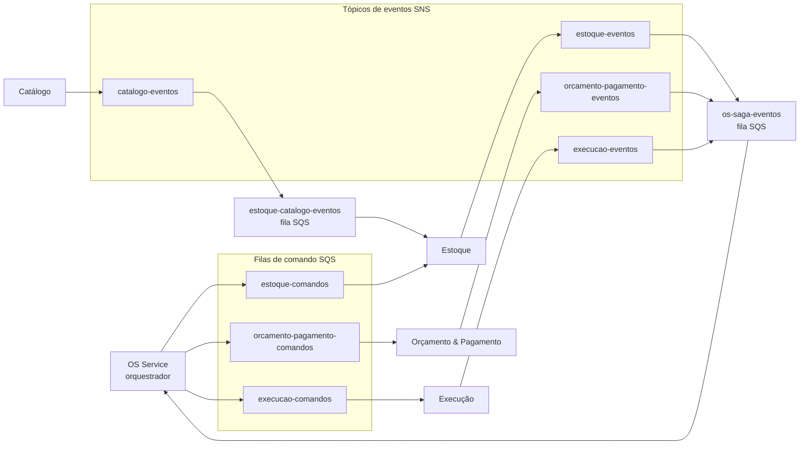
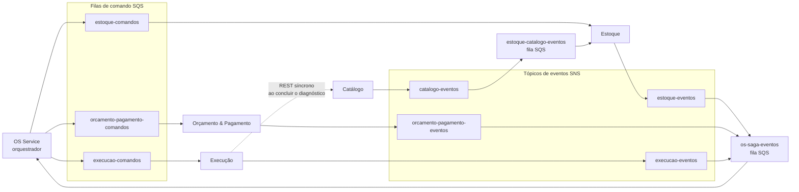

# RFC-0007: Mensageria entre microsserviços (SQS + SNS)

| | |
|---|---|
| **Status** | Aceito |
| **Data** | 2026-10-03 |

## Contexto

Com a decomposição em cinco microsserviços ([RFC-0006](0006-decomposicao-em-microsservicos.md)), os passos do fluxo da OS que têm efeito colateral (reservar estoque, gerar orçamento, cobrar, enfileirar a execução) passam a acontecer em serviços diferentes, coordenados por uma saga orquestrada ([ADR-0008](../adrs/0008-saga-orquestrada-no-os-service.md)). O PDF da Fase 4 exige mensageria assíncrona para eventos e integração desacoplada, além de REST síncrono quando necessário.

Requisitos da mensageria:

- **Comandos ponto a ponto** do orquestrador para um participante específico (por exemplo, `ReservarPecas` para o Estoque).
- **Eventos com múltiplos assinantes**: o resultado de um participante interessa ao orquestrador e, em alguns casos, a outros serviços (por exemplo, `PecaCadastrada` do Catálogo interessa ao Estoque).
- **Retenção quando o consumidor está fora do ar**, com reentrega e fila de mensagens mortas (DLQ) para o que falhar repetidamente.
- **Funcionar no AWS Academy Lab** e ser recriável do zero a cada rotação da conta, via Terraform no CI.
- **Rodar localmente** (docker-compose) e nos testes, sem depender da AWS.

## Alternativas consideradas

- **(Escolhida) Amazon SQS + Amazon SNS**: serviços gerenciados, sem nada para operar dentro do cluster, disponíveis no AWS Academy Lab e provisionados com poucas linhas de Terraform. SQS cobre os comandos ponto a ponto; SNS com assinaturas SQS cobre os eventos com vários assinantes (*fan-out*). Localmente, o LocalStack emula os dois com a mesma API (`boto3`).
- **(Descartada) RabbitMQ no cluster EKS**: portável e com roteamento flexível (exchanges), mas seria um componente com estado dentro do cluster: volume persistente, backup e alta disponibilidade por conta do projeto. No Lab, ele sumiria junto com o cluster a cada rotação, junto com as mensagens em trânsito.
- **(Descartada) Amazon MSK (Kafka)**: log de eventos com replay e alta vazão, que o volume da oficina não exige. O cluster MSK é caro, demora para provisionar e tem disponibilidade incerta no Lab.
- **(Descartada) Amazon EventBridge**: roteamento por regras de conteúdo, mais útil numa saga coreografada (que não é a escolha deste projeto). Para uma saga orquestrada, filas de comando e tópicos de eventos por serviço são mais diretos de entender e de demonstrar.

## Decisão

**SQS para comandos e SNS → SQS para eventos**, com a seguinte topologia (contratos completos em [`docs/saga.md`](../saga.md)):

- **Cada participante tem uma fila de comandos** (`<servico>-comandos`), consumida só por ele.
- **Cada serviço que publica eventos tem um tópico SNS** (`<servico>-eventos`). Quem tem interesse assina o tópico com uma fila própria: o orquestrador assina os tópicos de Estoque, Orçamento & Pagamento e Execução com a fila `os-saga-eventos`; o Estoque assina o tópico do Catálogo. O publicador não sabe quem consome.
- **Toda fila tem uma DLQ** (`<fila>-dlq`), para onde a mensagem vai depois de 5 tentativas de processamento sem sucesso.
- **Filas padrão, não FIFO.** A entrega é *at-least-once* e sem ordem garantida. Os consumidores tratam isso explicitamente, em vez de depender do broker:
  - **Idempotência**: toda mensagem tem um `message_id`. O consumidor registra os ids já processados na mesma transação do efeito colateral e descarta repetições.
  - **Ordem**: o orquestrador só aceita um evento se ele for válido para o estado atual da saga. Um evento fora de ordem ou atrasado (por exemplo, `PecasReservadas` chegando depois de a saga já ter sido compensada) é registrado e ignorado.
- **Publicação atômica com o banco (outbox).** O serviço grava a mudança de estado e a mensagem a ser publicada na mesma transação local (tabela `outbox`), e um processo separado publica no SQS/SNS. Isso evita os dois problemas clássicos: gravar no banco e cair antes de publicar (mensagem perdida), ou publicar e a transação falhar depois (mensagem fantasma). Nos serviços com DynamoDB, a mesma garantia vem de `TransactWriteItems` gravando o item de negócio e o item de outbox juntos.
- **Rastreamento distribuído.** Toda mensagem carrega, em `MessageAttributes`, o `saga_id`, o `order_id`, o `correlation_id` e os cabeçalhos de *trace context* do New Relic. Assim, o fluxo de uma OS aparece como um único trace atravessando os serviços, e os logs estruturados de todos eles podem ser filtrados pelo mesmo `order_id`.
- **Quem cria o quê no Terraform.** Cada serviço cria as próprias filas de comando, o próprio tópico de eventos e as filas com que assina os tópicos dos outros. Isso cria uma dependência de ordem de apply: o tópico de quem publica precisa existir antes da assinatura de quem consome (ver o diagrama de dependência em [`docs/arquitetura.md`](../arquitetura.md)).
- **Credenciais**: os pods acessam SQS/SNS pela mesma via de credenciais AWS que a aplicação já usa no cluster. Não há chave de acesso fixa no código nem na imagem.

## Consequências

- **Positivas**: nenhum componente de mensageria para operar dentro do cluster, e nada se perde quando um pod reinicia, porque as mensagens ficam retidas no SQS até serem processadas. Um serviço fora do ar só atrasa a saga, que retoma quando ele volta, em vez de falhar. Os participantes não conhecem o orquestrador: só leem a própria fila e publicam no próprio tópico.
- **Negativas**: entrega *at-least-once* sem ordem obriga idempotência e checagem de estado em todo consumidor. É código a mais, mas é também o que torna o sistema correto diante de reentregas. O padrão outbox adiciona uma tabela e um processo de publicação por serviço.
- **Dependência de nuvem**: o código de negócio fica isolado atrás de portas (`IMessagePublisher`, `IMessageConsumer`), com os adapters SQS/SNS em `adapters/`, seguindo a mesma Clean Architecture das fases anteriores. Trocar para RabbitMQ, por exemplo, exigiria só novos adapters.
- Esta RFC substitui a parte da [ADR-0001](../adrs/0001-padrao-de-comunicacao-sincrono.md) que descartava mensageria. A própria ADR-0001 já previa revisitar a decisão quando os contextos precisassem de deploy independente ou de comunicação assíncrona.

## Revisão (2026-10-03): a consulta REST da Execução ao Catálogo

Com a [ADR-0010](../adrs/0010-diagnostico-define-o-orcamento.md), a Execução passa a consultar o Catálogo por REST síncrono ao concluir o diagnóstico (ver a revisão da [RFC-0006](0006-decomposicao-em-microsservicos.md)). Isso não muda nenhuma fila nem tópico desta RFC, mas é uma dependência entre serviços que o diagrama acima não mostra. O diagrama completo, com essa chamada como linha tracejada (não é mensageria):

## Revisão (2026-10-03): filas de Orçamento e de Pagamento

Com a [RFC-0008](0008-separacao-orcamento-e-pagamento.md), a fila `orcamento-pagamento-comandos` e o tópico `orcamento-pagamento-eventos` dos diagramas acima viram dois pares: `orcamento-comandos`/`orcamento-eventos` e `pagamento-comandos`/`pagamento-eventos`. O orquestrador assina os dois tópicos novos com a mesma fila `os-saga-eventos`. Nenhuma regra desta RFC muda.
