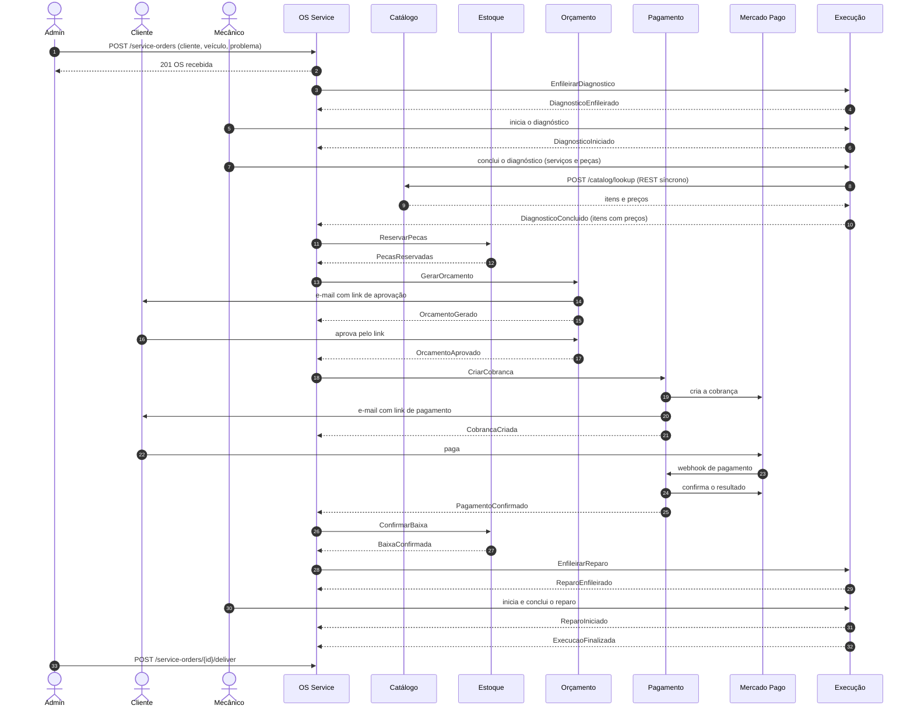

# Saga da ordem de serviço: contratos entre os microsserviços

Especificação da saga orquestrada que coordena o fluxo da OS entre os seis microsserviços da Fase 4. A justificativa das decisões está em [RFC-0006](rfcs/0006-decomposicao-em-microsservicos.md) e [RFC-0008](rfcs/0008-separacao-orcamento-e-pagamento.md) (divisão dos serviços), [RFC-0007](rfcs/0007-mensageria-sqs-sns.md) (mensageria), [ADR-0008](adrs/0008-saga-orquestrada-no-os-service.md) (estilo da saga), [ADR-0009](adrs/0009-persistencia-poliglota-por-servico.md) e [ADR-0011](adrs/0011-persistencia-orcamento-e-pagamento.md) (bancos) e [ADR-0010](adrs/0010-diagnostico-define-o-orcamento.md) (o diagnóstico define o orçamento). Este documento é o **contrato** que os seis repositórios implementam: mudou aqui, muda nos serviços.

## Participantes

| Serviço | Papel na saga | Recebe comandos em | Publica eventos em |
|---|---|---|---|
| OS Service | Orquestrador | — | — (consome `os-saga-eventos`) |
| Catálogo | Fora da saga (consultado por REST síncrono pela Execução ao concluir o diagnóstico) | — | `catalogo-eventos` |
| Estoque | Participante | `estoque-comandos` | `estoque-eventos` |
| Orçamento | Participante | `orcamento-comandos` | `orcamento-eventos` |
| Pagamento | Participante | `pagamento-comandos` | `pagamento-eventos` |
| Execução | Participante | `execucao-comandos` | `execucao-eventos` |

## Fluxo feliz



## Estados da saga e status da OS

O status da OS, visível para o cliente no rastreio, é derivado do estado da saga. Os dois são gravados na mesma transação.

| Estado da saga | Status da OS | Aguardando |
|---|---|---|
| `ENFILEIRANDO_DIAGNOSTICO` | `recebida` | `DiagnosticoEnfileirado` / `EnfileiramentoFalhou` |
| `AGUARDANDO_DIAGNOSTICO` | `recebida` → `em_diagnostico` (ao receber `DiagnosticoIniciado`) | `DiagnosticoConcluido` |
| `RESERVANDO_PECAS` | `em_diagnostico` | `PecasReservadas` / `ReservaRecusada` |
| `GERANDO_ORCAMENTO` | `em_diagnostico` | `OrcamentoGerado` / `OrcamentoFalhou` |
| `AGUARDANDO_APROVACAO` | `aguardando_aprovacao` | `OrcamentoAprovado` / `OrcamentoRecusado` / prazo |
| `GERANDO_COBRANCA` | `aguardando_pagamento` | `CobrancaCriada` / `CobrancaFalhou` |
| `AGUARDANDO_PAGAMENTO` | `aguardando_pagamento` | `PagamentoConfirmado` / `PagamentoRecusado` / prazo |
| `CONFIRMANDO_BAIXA` | `aguardando_pagamento` | `BaixaConfirmada` / `BaixaFalhou` |
| `ENFILEIRANDO_REPARO` | `aguardando_pagamento` | `ReparoEnfileirado` / `EnfileiramentoFalhou` |
| `EM_REPARO` | `em_execucao` | `ReparoIniciado`, `ExecucaoFinalizada` |
| `CONCLUIDA` | `finalizada` → `entregue` | entrega (ação do admin, fora da saga) |
| `COMPENSANDO` | inalterado até o fim da compensação | confirmações das compensações |
| `CANCELADA` | `recusada` (cliente recusou o orçamento) ou `cancelada` (qualquer outra falha) | — |

## Comandos (orquestrador → participante)

| Comando | Destino | Efeito | Compensado por | Respostas possíveis |
|---|---|---|---|---|
| `EnfileirarDiagnostico` | Execução | Coloca a OS na fila de diagnóstico | — (sem efeito sobre outros serviços) | `DiagnosticoEnfileirado`, `EnfileiramentoFalhou` |
| `ReservarPecas` | Estoque | Reserva o saldo de todas as peças definidas no diagnóstico, tudo ou nada | `LiberarPecas` | `PecasReservadas`, `ReservaRecusada` |
| `GerarOrcamento` | Orçamento | Cria o orçamento a partir dos itens do diagnóstico (com os preços copiados do Catálogo) e envia o e-mail de aprovação | `CancelarOrcamento` | `OrcamentoGerado`, `OrcamentoFalhou` |
| `CriarCobranca` | Pagamento | Cria a cobrança no Mercado Pago (valor, itens e e-mail do cliente vêm no comando) e envia o link de pagamento | `CancelarCobranca` (se não pago) / `EstornarPagamento` (se pago) | `CobrancaCriada`, `CobrancaFalhou` |
| `ConfirmarBaixa` | Estoque | Transforma a reserva em baixa definitiva | `DevolverPecas` | `BaixaConfirmada`, `BaixaFalhou` |
| `EnfileirarReparo` | Execução | Coloca a OS na fila de reparo | — (ponto sem volta) | `ReparoEnfileirado`, `EnfileiramentoFalhou` |

### Compensações

| Comando | Destino | Efeito | Confirmação |
|---|---|---|---|
| `LiberarPecas` | Estoque | Desfaz a reserva | `PecasLiberadas` |
| `DevolverPecas` | Estoque | Devolve ao saldo as peças já baixadas | `PecasDevolvidas` |
| `CancelarOrcamento` | Orçamento | Invalida o orçamento e o link de aprovação | `OrcamentoCancelado` |
| `CancelarCobranca` | Pagamento | Cancela no Mercado Pago a cobrança ainda não paga (o link de pagamento deixa de funcionar) | `CobrancaCancelada` |
| `EstornarPagamento` | Pagamento | Estorna no Mercado Pago o pagamento já feito | `PagamentoEstornado` |

Compensações são idempotentes e **sempre** respondem com a confirmação, inclusive quando não havia nada a desfazer (por exemplo, `LiberarPecas` para uma reserva que nunca chegou a ser feita). Isso permite que o orquestrador as reenvie com segurança.

### Ordem das compensações por ponto de falha

| Falha em | Compensações (em ordem) | Status final da OS |
|---|---|---|
| `EnfileiramentoFalhou` (diagnóstico) | nenhuma | `cancelada` |
| `ReservaRecusada` | nenhuma | `cancelada` |
| `OrcamentoFalhou` | `LiberarPecas` | `cancelada` |
| `OrcamentoRecusado` | `LiberarPecas` | `recusada` |
| Prazo de aprovação expirado | `CancelarOrcamento`, `LiberarPecas` | `cancelada` |
| `CobrancaFalhou` | `CancelarOrcamento`, `LiberarPecas` | `cancelada` |
| `PagamentoRecusado` ou prazo de pagamento expirado | `CancelarCobranca`, `CancelarOrcamento`, `LiberarPecas` | `cancelada` |
| `BaixaFalhou` | `EstornarPagamento`, `CancelarOrcamento`, `LiberarPecas` | `cancelada` |
| `EnfileiramentoFalhou` (reparo) | `EstornarPagamento`, `CancelarOrcamento`, `DevolverPecas` | `cancelada` |

## Eventos sem comando correspondente

| Evento | Publicado por | Consumido por | Significado |
|---|---|---|---|
| `OrcamentoAprovado` / `OrcamentoRecusado` | Orçamento | OS Service | Decisão do cliente pelo link do e-mail (ou do admin, pela API do serviço) |
| `PagamentoConfirmado` / `PagamentoRecusado` | Pagamento | OS Service | Resultado do pagamento, recebido pelo webhook do Mercado Pago e confirmado numa consulta à API dele (o webhook em si não é confiável como prova de pagamento) |
| `DiagnosticoIniciado` | Execução | OS Service | O mecânico começou a examinar o veículo |
| `DiagnosticoConcluido` | Execução | OS Service | Diagnóstico pronto, com as notas do mecânico e os serviços e peças necessários (preços já copiados do Catálogo). Dispara a reserva de peças |
| `ReparoIniciado`, `ExecucaoFinalizada` | Execução | OS Service | Andamento do reparo, atualizado pelos mecânicos |
| `PecaCadastrada` | Catálogo | Estoque | Peça nova no catálogo: o Estoque cria o saldo zerado dela |

## Envelope das mensagens

Todas as mensagens (comandos e eventos) usam o mesmo envelope JSON no corpo:

```json
{
  "message_id": "0b7d6c1e-5f0a-4a52-9c1b-6a1f3e2d9b10",
  "type": "ReservarPecas",
  "saga_id": "c9a1f0de-2b44-4a5e-8e57-0d3f1b6c7a21",
  "order_id": 42,
  "occurred_at": "2026-10-03T14:05:12Z",
  "payload": {
    "items": [{ "part_id": "3f0c5a8e-1d2b-5c4e-9a7f-6b8d0e1f2a3c", "quantity": 4 }]
  }
}
```

E repete nos `MessageAttributes` do SQS/SNS: `type`, `saga_id`, `order_id`, `correlation_id` e os cabeçalhos de *trace context* do New Relic (`newrelic`, `traceparent`, `tracestate`). Os atributos permitem filtrar assinaturas SNS por tipo e propagar o trace sem abrir o corpo da mensagem.

Regras para todos os consumidores:

- **Idempotência por `message_id`**: registrar os ids processados na mesma transação do efeito colateral e descartar repetições.
- **Eventos fora de ordem ou atrasados**: o orquestrador ignora (e registra em log) eventos que não são válidos para o estado atual da saga.
- **Erros**: falha de negócio vira um evento de falha (`ReservaRecusada`, `OrcamentoFalhou`, ...), nunca uma exceção. Exceção é reservada para falha técnica (banco fora, bug) e faz a mensagem voltar para a fila; depois de 5 tentativas, ela vai para a DLQ.

## Payloads

Conteúdo do campo `payload` de cada mensagem. `saga_id` e `order_id` vão sempre no envelope, nunca no payload.

### Execução ([oficina-mecanica-execucao](https://github.com/phantosmia/oficina-mecanica-execucao))

| Mensagem | Payload |
|---|---|
| `EnfileirarDiagnostico` | `problem_description` (obrigatório) e `vehicle` opcional: `{plate, brand, model, year}` |
| `DiagnosticoEnfileirado`, `ReparoEnfileirado`, `DiagnosticoIniciado`, `ReparoIniciado` | vazio |
| `EnfileirarReparo` | vazio |
| `EnfileiramentoFalhou` | `etapa` (`diagnostico` ou `reparo`) e `reason` (`payload_invalido`, `os_ja_esta_na_execucao`, `os_nao_encontrada`, `status_<etapa atual>`) |
| `DiagnosticoConcluido` | `notes`; `services`: `[{service_id, name, quantity, unit_price, subtotal}]`; `parts`: `[{part_id, name, quantity, unit_price, subtotal}]`; `labor_total`, `parts_total`, `total`. Preços copiados do Catálogo no momento do diagnóstico |
| `ExecucaoFinalizada` | `notes` (pode ser `null`) |

### Pagamento ([oficina-mecanica-pagamento](https://github.com/phantosmia/oficina-mecanica-pagamento))

| Mensagem | Payload |
|---|---|
| `CriarCobranca` | `quote_id`, `customer`: `{name, email}`, `services` e `parts` (os itens do orçamento aprovado, com `name`, `quantity`, `unit_price`). O valor é recalculado a partir dos itens; um `total` no comando é ignorado. O orquestrador tem esses dados do `DiagnosticoConcluido` e da abertura da OS |
| `CobrancaCriada` | `charge_id`, `provider_order_id` (ID da order no Mercado Pago), `checkout_url` (link de pagamento), `amount` |
| `CobrancaFalhou` | `reason` (`payload_invalido`, `provedor_recusou` com `code` do Mercado Pago, `saga_ja_compensada`) |
| `PagamentoConfirmado` | `charge_id`, `provider_order_id`, `amount` |
| `PagamentoRecusado` | `charge_id`, `provider_order_id`, `amount`, `provider_status` (ex.: `expired`, `failed`), `provider_status_detail` |
| `CancelarCobranca`, `EstornarPagamento` | vazio |
| `CobrancaCancelada`, `PagamentoEstornado` | `charge_id` (`null` se a cobrança nunca chegou a existir) e `refunded`: se houve estorno (o Pagamento olha o estado real no Mercado Pago: cancelar uma cobrança que acabou de ser paga vira estorno, e estornar uma que não foi paga vira cancelamento) |

### Orçamento ([oficina-mecanica-orcamento](https://github.com/phantosmia/oficina-mecanica-orcamento))

| Mensagem | Payload |
|---|---|
| `GerarOrcamento` | O payload do `DiagnosticoConcluido` (`notes`, `services`, `parts`) mais `customer`: `{name, email}`, que o orquestrador tem da abertura da OS. Totais que vierem no comando são ignorados: o Orçamento recalcula a partir dos itens. Sem `customer.email`, o orçamento é criado mas não é enviado por e-mail (o admin pega o link em `GET /quotes/{order_id}`) |
| `OrcamentoGerado` | `quote_id`, `labor_total`, `parts_total`, `total`, `valid_until` |
| `OrcamentoFalhou` | `reason` (`payload_invalido`, `os_ja_tem_orcamento`, `saga_ja_compensada`) |
| `OrcamentoAprovado`, `OrcamentoRecusado` | `quote_id`, `total`, `decided_by` (`cliente` ou `admin`) |
| `CancelarOrcamento` | vazio |
| `OrcamentoCancelado` | `quote_id` (`null` se o orçamento nunca chegou a existir) |

### Estoque ([oficina-mecanica-estoque](https://github.com/phantosmia/oficina-mecanica-estoque))

| Mensagem | Payload |
|---|---|
| `ReservarPecas` | `items`: `[{part_id, quantity}]`. O orquestrador monta a partir de `DiagnosticoConcluido.parts`. Lista vazia é válida (diagnóstico só com serviços) |
| `PecasReservadas`, `BaixaConfirmada` | `reservation_id` e `items`: `[{part_id, quantity}]` |
| `ReservaRecusada` | `reservation_id`, `reason` (`estoque_insuficiente`, `quantidade_invalida`, `saga_ja_compensada`) e `unavailable`: `[{part_id, requested, available, reason}]` |
| `ConfirmarBaixa`, `LiberarPecas`, `DevolverPecas` | vazio |
| `BaixaFalhou` | `reason` (`reserva_inexistente`, `reserva_<status>`) |
| `PecasLiberadas`, `PecasDevolvidas` | vazio |

### Catálogo ([oficina-mecanica-catalogo](https://github.com/phantosmia/oficina-mecanica-catalogo))

| Mensagem | Payload |
|---|---|
| `PecaCadastrada` | `part_id`, `sku`, `name` |

A consulta síncrona da Execução ao Catálogo é `POST /catalog/lookup` com `{service_ids, part_ids}` (até 100 de cada). A resposta traz os itens encontrados (com `active`) e os IDs inexistentes em `missing_service_ids`/`missing_part_ids`.

## Prazos

| Espera | Prazo padrão | Ao expirar |
|---|---|---|
| Resposta de participante a um comando (não inclui o trabalho do mecânico: o diagnóstico e o reparo não têm prazo automático) | 5 minutos | Reenvia o comando (até 3 vezes); depois, compensa |
| Aprovação do orçamento pelo cliente | 7 dias | Compensa (`CancelarOrcamento`, `LiberarPecas`) |
| Pagamento após a cobrança | 3 dias | Compensa (`CancelarOrcamento`, `LiberarPecas`) |

Os prazos são configuráveis por variável de ambiente no OS Service. Para a demonstração em vídeo, podem ser reduzidos para segundos.

## Como provocar cada falha (testes e demonstração)

- **`ReservaRecusada`**: concluir um diagnóstico pedindo mais peças do que o saldo do Estoque.
- **`OrcamentoRecusado`**: clicar em "recusar" no link do e-mail de orçamento.
- **`PagamentoRecusado`**: deixar a cobrança expirar sem pagamento (reduzir `PAYMENT_EXPIRATION` no Pagamento, por exemplo para `PT2M`); a reconciliação detecta a expiração. Compensa com `CancelarCobranca`, `CancelarOrcamento` e `LiberarPecas`. No Checkout Pro, o comprador pode tentar de novo depois de um cartão recusado (titular `OTHE`), então a expiração é o caminho garantido para a recusa definitiva. **A confirmar no teste pelo navegador:** se um cartão recusado leva a order a `failed` (o que também viraria `PagamentoRecusado`) ou a mantém aberta.
- **Prazo expirado**: reduzir o prazo de aprovação ou de pagamento e não responder.
- **Participante fora do ar**: escalar o Deployment da Execução para 0 réplicas antes do pagamento. A saga fica em `ENFILEIRANDO_REPARO`, reenvia o comando e, ao reativar o serviço, continua de onde parou. Mantendo o serviço fora do ar até esgotar as tentativas, ela compensa (`EstornarPagamento`, `CancelarOrcamento`, `DevolverPecas`).
