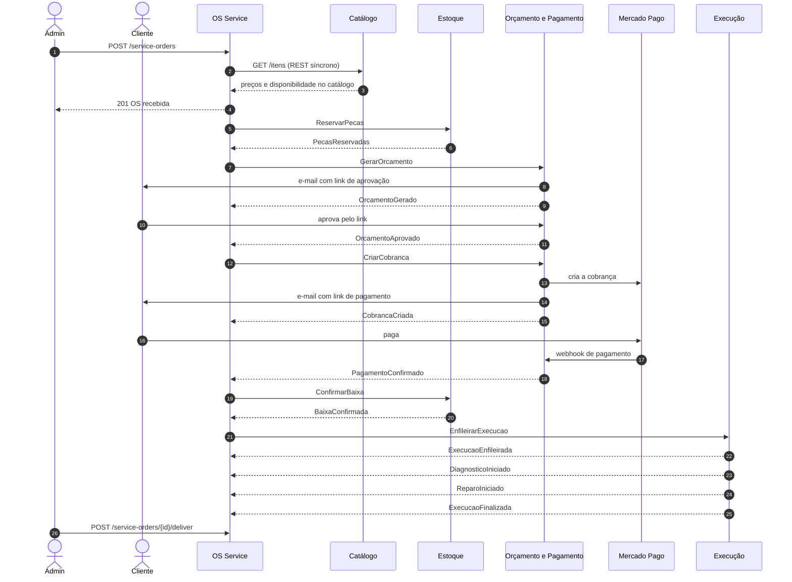

# Saga da ordem de serviço: contratos entre os microsserviços

Especificação da saga orquestrada que coordena o fluxo da OS entre os cinco microsserviços da Fase 4. A justificativa das decisões está em [RFC-0006](rfcs/0006-decomposicao-em-microsservicos.md) (divisão dos serviços), [RFC-0007](rfcs/0007-mensageria-sqs-sns.md) (mensageria), [ADR-0008](adrs/0008-saga-orquestrada-no-os-service.md) (estilo da saga) e [ADR-0009](adrs/0009-persistencia-poliglota-por-servico.md) (bancos). Este documento é o **contrato** que os cinco repositórios implementam: mudou aqui, muda nos serviços.

## Participantes

| Serviço | Papel na saga | Recebe comandos em | Publica eventos em |
|---|---|---|---|
| OS Service | Orquestrador | — | — (consome `os-saga-eventos`) |
| Catálogo | Fora da saga (REST síncrono na abertura da OS) | — | `catalogo-eventos` |
| Estoque | Participante | `estoque-comandos` | `estoque-eventos` |
| Orçamento & Pagamento | Participante | `orcamento-pagamento-comandos` | `orcamento-pagamento-eventos` |
| Execução | Participante | `execucao-comandos` | `execucao-eventos` |

## Fluxo feliz



## Estados da saga e status da OS

O status da OS, visível para o cliente no rastreio, é derivado do estado da saga. Os dois são gravados na mesma transação.

| Estado da saga | Status da OS | Aguardando |
|---|---|---|
| `RESERVANDO_PECAS` | `recebida` | `PecasReservadas` / `ReservaRecusada` |
| `GERANDO_ORCAMENTO` | `recebida` | `OrcamentoGerado` / `OrcamentoFalhou` |
| `AGUARDANDO_APROVACAO` | `aguardando_aprovacao` | `OrcamentoAprovado` / `OrcamentoRecusado` / prazo |
| `GERANDO_COBRANCA` | `aguardando_pagamento` | `CobrancaCriada` / `CobrancaFalhou` |
| `AGUARDANDO_PAGAMENTO` | `aguardando_pagamento` | `PagamentoConfirmado` / `PagamentoRecusado` / prazo |
| `CONFIRMANDO_BAIXA` | `aguardando_pagamento` | `BaixaConfirmada` / `BaixaFalhou` |
| `ENFILEIRANDO_EXECUCAO` | `aguardando_pagamento` | `ExecucaoEnfileirada` / `EnfileiramentoFalhou` |
| `EM_EXECUCAO` | `em_diagnostico` → `em_execucao` | `DiagnosticoIniciado`, `ReparoIniciado`, `ExecucaoFinalizada` |
| `CONCLUIDA` | `finalizada` → `entregue` | entrega (ação do admin, fora da saga) |
| `COMPENSANDO` | inalterado até o fim da compensação | confirmações das compensações |
| `CANCELADA` | `recusada` (cliente recusou o orçamento) ou `cancelada` (qualquer outra falha) | — |

## Comandos (orquestrador → participante)

| Comando | Destino | Efeito | Compensado por | Respostas possíveis |
|---|---|---|---|---|
| `ReservarPecas` | Estoque | Reserva o saldo de todas as peças da OS, tudo ou nada | `LiberarPecas` | `PecasReservadas`, `ReservaRecusada` |
| `GerarOrcamento` | Orçamento & Pagamento | Cria o orçamento a partir dos itens (com preços copiados na abertura) e envia o e-mail de aprovação | `CancelarOrcamento` | `OrcamentoGerado`, `OrcamentoFalhou` |
| `CriarCobranca` | Orçamento & Pagamento | Cria a cobrança no Mercado Pago e envia o link de pagamento | `EstornarPagamento` (se pago) / `CancelarOrcamento` | `CobrancaCriada`, `CobrancaFalhou` |
| `ConfirmarBaixa` | Estoque | Transforma a reserva em baixa definitiva | `DevolverPecas` | `BaixaConfirmada`, `BaixaFalhou` |
| `EnfileirarExecucao` | Execução | Coloca a OS na fila de execução | — (ponto sem volta) | `ExecucaoEnfileirada`, `EnfileiramentoFalhou` |

### Compensações

| Comando | Destino | Efeito | Confirmação |
|---|---|---|---|
| `LiberarPecas` | Estoque | Desfaz a reserva | `PecasLiberadas` |
| `DevolverPecas` | Estoque | Devolve ao saldo as peças já baixadas | `PecasDevolvidas` |
| `CancelarOrcamento` | Orçamento & Pagamento | Invalida o orçamento e o link de aprovação/pagamento | `OrcamentoCancelado` |
| `EstornarPagamento` | Orçamento & Pagamento | Estorna o pagamento no Mercado Pago | `PagamentoEstornado` |

Compensações são idempotentes e **sempre** respondem com a confirmação, inclusive quando não havia nada a desfazer (por exemplo, `LiberarPecas` para uma reserva que nunca chegou a ser feita). Isso permite que o orquestrador as reenvie com segurança.

### Ordem das compensações por ponto de falha

| Falha em | Compensações (em ordem) | Status final da OS |
|---|---|---|
| `ReservaRecusada` | nenhuma | `cancelada` |
| `OrcamentoFalhou` | `LiberarPecas` | `cancelada` |
| `OrcamentoRecusado` | `LiberarPecas` | `recusada` |
| Prazo de aprovação expirado | `CancelarOrcamento`, `LiberarPecas` | `cancelada` |
| `CobrancaFalhou`, `PagamentoRecusado` ou prazo de pagamento expirado | `CancelarOrcamento`, `LiberarPecas` | `cancelada` |
| `BaixaFalhou` | `EstornarPagamento`, `LiberarPecas` | `cancelada` |
| `EnfileiramentoFalhou` | `EstornarPagamento`, `DevolverPecas` | `cancelada` |

## Eventos sem comando correspondente

| Evento | Publicado por | Consumido por | Significado |
|---|---|---|---|
| `OrcamentoAprovado` / `OrcamentoRecusado` | Orçamento & Pagamento | OS Service | Decisão do cliente pelo link do e-mail (ou do admin, pela API do serviço) |
| `PagamentoConfirmado` / `PagamentoRecusado` | Orçamento & Pagamento | OS Service | Resultado do pagamento, recebido pelo webhook do Mercado Pago |
| `DiagnosticoIniciado`, `ReparoIniciado`, `ExecucaoFinalizada` | Execução | OS Service | Andamento da execução, atualizado pelos mecânicos |
| `PecaCadastrada` | Catálogo | Estoque | Peça nova no catálogo: o Estoque cria o saldo zerado dela |

## Envelope das mensagens

Todas as mensagens (comandos e eventos) usam o mesmo envelope JSON no corpo:

```json
{
  "message_id": "0b7d6c1e-5f0a-4a52-9c1b-6a1f3e2d9b10",
  "type": "ReservarPecas",
  "saga_id": "c9a1f0de-2b44-4a5e-8e57-0d3f1b6c7a21",
  "order_id": 42,
  "occurred_at": "2026-10-03T14:05:12Z",
  "payload": {
    "items": [{ "part_id": "p-oleo-5w30", "quantity": 4 }]
  }
}
```

E repete nos `MessageAttributes` do SQS/SNS: `type`, `saga_id`, `order_id`, `correlation_id` e os cabeçalhos de *trace context* do New Relic (`newrelic`, `traceparent`, `tracestate`). Os atributos permitem filtrar assinaturas SNS por tipo e propagar o trace sem abrir o corpo da mensagem.

Regras para todos os consumidores:

- **Idempotência por `message_id`**: registrar os ids processados na mesma transação do efeito colateral e descartar repetições.
- **Eventos fora de ordem ou atrasados**: o orquestrador ignora (e registra em log) eventos que não são válidos para o estado atual da saga.
- **Erros**: falha de negócio vira um evento de falha (`ReservaRecusada`, `OrcamentoFalhou`, ...), nunca uma exceção. Exceção é reservada para falha técnica (banco fora, bug) e faz a mensagem voltar para a fila; depois de 5 tentativas, ela vai para a DLQ.

## Prazos

| Espera | Prazo padrão | Ao expirar |
|---|---|---|
| Resposta de participante a um comando | 5 minutos | Reenvia o comando (até 3 vezes); depois, compensa |
| Aprovação do orçamento pelo cliente | 7 dias | Compensa (`CancelarOrcamento`, `LiberarPecas`) |
| Pagamento após a cobrança | 3 dias | Compensa (`CancelarOrcamento`, `LiberarPecas`) |

Os prazos são configuráveis por variável de ambiente no OS Service. Para a demonstração em vídeo, podem ser reduzidos para segundos.

## Como provocar cada falha (testes e demonstração)

- **`ReservaRecusada`**: abrir uma OS pedindo mais peças do que o saldo do Estoque.
- **`OrcamentoRecusado`**: clicar em "recusar" no link do e-mail de orçamento.
- **`PagamentoRecusado`**: pagar no sandbox do Mercado Pago com um cartão de teste configurado para ser recusado.
- **Prazo expirado**: reduzir o prazo de aprovação ou de pagamento e não responder.
- **Participante fora do ar**: escalar o Deployment da Execução para 0 réplicas antes do pagamento. A saga fica em `ENFILEIRANDO_EXECUCAO`, reenvia o comando e, ao reativar o serviço, continua de onde parou. Mantendo o serviço fora do ar até esgotar as tentativas, ela compensa (`EstornarPagamento`, `DevolverPecas`).
